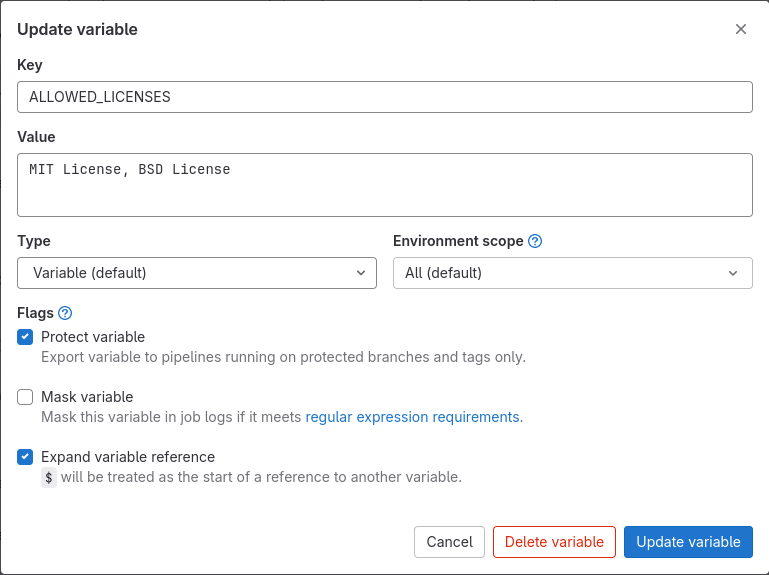

# PythonLicenseChecker


## Использование скрипта в GitLab CI

1. В Variables (Settings -> CI/CD -> Variables) проекта необходимо добавить новую переменную ALLOWED_LICENSES с перечислением разрешенных лицензий (через запятую с пробелом)

    

2. В yml файле добавить новый stage и вставить следующий код:
```yml
license_checking:
  stage: license_checking
  image:
    name: harbor.dockerhub.work/gitlab/pythonlicensechecker:latest

  variables:
    ALLOWED_LICENSES: $ALLOWED_LICENSES
  script: 
    - python_checker $CI_PROJECT_DIR
  allow_failure: true

```
3. Результат выполненой проверки по всем файлам с зависимостями находится в job

## !!! Скрипт может найти только файлы содержащие ключевое слово "requirements"